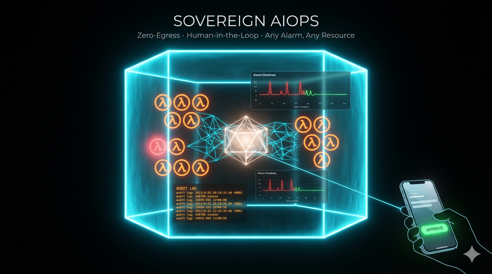

# aws-sovereign-ops

Zero-egress AI operations platform for AWS. An autonomous agent detects infrastructure failures, proposes fixes, and executes them — only after a human approves. Everything runs inside a private VPC. No AI traffic ever leaves to the internet.



> Autonomous infrastructure remediation powered by Amazon Bedrock via PrivateLink — zero-egress, Human-in-the-Loop, full CloudTrail audit trail. SOC2 / HIPAA / PCI-DSS ready.

---

## Architecture

```
┌─────────────────────────────────────────────────────────────────┐
│  PRIVATE VPC  (zero-egress — no route to 0.0.0.0/0)            │
│                                                                  │
│  CloudWatch Alarm                                                │
│  OOMKilled / latency / error rate                               │
│         │                                                        │
│         ▼ EventBridge                                            │
│  ┌──────────────────┐      PrivateLink       ┌───────────────┐  │
│  │  MCP Server      │ ◄──────────────────── ►│   Bedrock     │  │
│  │  (ECS Fargate)   │    (VPC Interface      │ Claude / Nova │  │
│  │                  │      Endpoint)         └───────────────┘  │
│  │  analyze_incident│                                            │
│  │  propose_fix     │                                            │
│  │  execute_approved│◄── Human APPROVE token                    │
│  │  rollback        │                                            │
│  └────────┬─────────┘                                            │
│           │ AWS Cloud Control API                                │
│           ▼                                                      │
│  EKS / ECS / RDS ──► CloudTrail (S3 WORM + KMS)                │
│                       immutable audit log                        │
└───────────────────────┬─────────────────────────────────────────┘
                        │ Lambda + SNS
                        ▼
             OPERATOR receives:
             • What happened (plain language)
             • Root cause identified
             • Proposed fix (Terraform diff)
             • Expected state after fix
             • Change risk level
             Decides: APPROVE / REJECT
```

---

## How It Works — Demo Scenario (Pod OOMKilled)

```
1. EKS pod hits memory limit → OOMKilled
        ↓
2. CloudWatch alarm → EventBridge → MCP Server triggered
        ↓
3. MCP Server calls Bedrock via PrivateLink (no internet)
   Bedrock analyzes: pod logs + metrics + crash history
        ↓
4. Fix proposal generated:
   - Root cause: memory leak at /api/infer endpoint
   - Fix: memory limit 512MB → 1GB + HPA minReplicas 2 → 3
   - Risk: low — configuration change only, no destructive ops
   - Expected: pod stable, p99 latency < 200ms
        ↓
5. Operator receives Slack/email notification with APPROVE / REJECT
        ↓
6. Operator approves → MCP Server executes:
   kubectl patch + terraform apply (HPA update)
   Every action recorded in CloudTrail: task_id, approved_by, timestamp
        ↓
7. Agent validates metrics post-apply → incident documented
   Total time: < 5 minutes vs 45 minutes manual
```

---

## Tech Stack

| Layer | Technology |
|-------|------------|
| IaC | Terraform >= 1.5 — modular, reuses tf-modules-forge |
| Agent Compute | ECS Fargate — no nodes to manage |
| AI Brain | Amazon Bedrock (Claude 3 Haiku demo / Sonnet prod) |
| AI Transport | VPC Interface Endpoint — Bedrock never touches internet |
| Agent Framework | MCP (Model Context Protocol) — Python |
| Event Trigger | CloudWatch Alarms + EventBridge |
| HITL Notifier | AWS Lambda + SNS |
| Audit | CloudTrail — S3 WORM bucket + KMS encryption |
| IAM | Least-privilege — no IAM write, no billing, no root access |
| Networking | VPC zero-egress — PrivateLink for Bedrock, CloudWatch, STS |

---

## Repository Structure

```
aws-sovereign-ops/
├── modules/
│   ├── bedrock-privatelink/     # VPC Interface Endpoints for Bedrock + CW + STS
│   ├── cloudtrail-audit/        # CloudTrail + S3 WORM bucket + KMS
│   └── cloudwatch-alarms/       # OOMKilled, latency, error rate alarms
├── examples/
│   └── sovereign-aiops/         # Full stack demo — assembles all modules
├── mcp-server/
│   ├── server.py                # MCP Server entrypoint
│   ├── tools/
│   │   ├── analyze_incident.py  # Read-only — pulls logs + metrics from CloudWatch
│   │   ├── propose_fix.py       # Generates Terraform diff + risk assessment
│   │   ├── execute_approved.py  # Applies fix after validating HITL token
│   │   └── rollback.py          # Reverts last apply after HITL approval
│   └── requirements.txt
├── lambda/
│   └── hitl-notifier/           # Sends APPROVE/REJECT notification to operator
├── scripts/
│   └── demo.sh                  # Simulates OOMKilled and runs full remediation loop
└── docs/
    └── architecture.md
```

---

## Modules

### `modules/bedrock-privatelink`

Creates VPC Interface Endpoints for Amazon Bedrock, CloudWatch, and STS — enabling the MCP Server to call Bedrock without any traffic leaving the VPC.

| Resource | Purpose |
|----------|---------|
| `aws_vpc_endpoint` — Bedrock Runtime | LLM inference via PrivateLink |
| `aws_vpc_endpoint` — CloudWatch | Metrics + logs from within VPC |
| `aws_vpc_endpoint` — STS | IAM role assumption without internet |
| Security Group | Restricts endpoint access to MCP Server SG only |

---

### `modules/cloudtrail-audit`

Immutable audit trail for every agent action. The agent cannot delete or modify its own audit log.

| Resource | Purpose |
|----------|---------|
| CloudTrail (multi-region) | Captures every API call with task_id tag |
| S3 bucket — WORM policy | Object Lock prevents deletion or overwrite |
| KMS key | Encrypts all CloudTrail events at rest |
| S3 bucket policy | Denies `s3:DeleteObject` even to the agent role |

---

### `modules/cloudwatch-alarms`

Pre-built alarms that trigger the autonomous remediation loop.

| Alarm | Metric | Threshold |
|-------|--------|-----------|
| `oomkilled` | `kube_pod_container_status_last_terminated_reason` | >= 1 |
| `high-latency` | ALB `TargetResponseTime` p99 | > 2s for 5 min |
| `error-rate` | ALB `HTTPCode_Target_5XX_Count` | > 5% for 5 min |
| `cpu-overload` | ECS `CPUUtilization` | > 85% for 10 min |

---

## MCP Server Tools

| Tool | Access | Requires HITL Token |
|------|--------|---------------------|
| `analyze_incident` | Read-only — CloudWatch logs + metrics | No |
| `propose_fix` | Generates TF diff + risk score | No |
| `execute_approved` | Applies fix to AWS resources | Yes — validates token |
| `rollback` | Reverts last terraform apply | Yes — validates token |

Read-only tools run freely. Any write action requires a one-time token issued by the HITL Lambda after operator approval. Tokens expire in 15 minutes.

---

## Security Layers

```
Layer 1 — Network:    Zero-egress VPC, PrivateLink only — no NAT, no IGW for agent traffic
Layer 2 — IAM:        Least privilege — no IAM write, no billing, no root access
Layer 3 — MCP:        Read-only by default — write requires HITL session token
Layer 4 — Terraform:  Blast radius control — max resources per apply enforced
Layer 5 — Audit:      CloudTrail WORM — immutable, tied to task_id + approver identity
Layer 6 — Circuit:    2 consecutive failures → agent suspends + escalates to human
```

---

## Target Use Cases

| Industry | Compliance | Use Case |
|----------|------------|---------|
| Fintech | SOC2 / PCI-DSS | Autonomous incident response without data leaving regulated perimeter |
| Healthtech | HIPAA | AI-assisted ops where PHI workloads cannot touch public AI endpoints |
| SaaS B2B | SOC2 | Platform reliability teams reducing MTTR without manual on-call toil |

---

## Estimated Lab Cost (48-hour demo)

| Resource | Estimated Cost |
|----------|---------------|
| VPC Interface Endpoints x3 (48h) | ~$1.75 |
| ECS Fargate — MCP Server (48h) | ~$0.50 |
| Bedrock Claude 3 Haiku — demo tokens | ~$0.50 |
| CloudWatch + S3 + CloudTrail | ~$0.30 |
| Lambda HITL notifier | ~$0.00 (free tier) |
| **Total** | **< $5 USD** |

> Run `make destroy-example` after the demo. VPC Interface Endpoints charge per hour regardless of traffic.

---

## Prerequisites

Install these tools before cloning the repo.

| Tool | Version | Install |
|------|---------|---------|
| `make` | any | **macOS:** `xcode-select --install` · **Ubuntu/Debian:** `sudo apt install make` · **Windows:** [GnuWin32](https://gnuwin32.sourceforge.net/packages/make.htm) |
| `python3` | >= 3.11 | **macOS:** `brew install python@3.11` · **Ubuntu:** `sudo apt install python3.11` · **Windows:** [python.org](https://www.python.org/downloads/) |
| `pip` | any | included with Python 3.11+ |
| `terraform` | >= 1.5 | [developer.hashicorp.com/terraform/install](https://developer.hashicorp.com/terraform/install) |
| `aws cli` | v2 | [docs.aws.amazon.com/cli/latest/userguide/install-cliv2.html](https://docs.aws.amazon.com/cli/latest/userguide/install-cliv2.html) |

**AWS requirements:**
- AWS CLI configured: `aws configure`
- Amazon Bedrock model access enabled: `anthropic.claude-3-haiku-20240307-v1:0` in your AWS account and region

> Bedrock model access is disabled by default. Enable it at:
> AWS Console → Amazon Bedrock → Model access → Request access → Claude 3 Haiku

---

## Quick Start

All commands run from the **repo root directory** after cloning.

```bash
# Clone
git clone https://github.com/kratosvil/aws-sovereign-ops.git
cd aws-sovereign-ops

# Install MCP Server dependencies (run once)
make mcp-install

# Set required environment variables
export AWS_REGION=us-east-1
export BEDROCK_MODEL_ID=anthropic.claude-3-haiku-20240307-v1:0
export HITL_SNS_TOPIC=arn:aws:sns:us-east-1:YOUR_ACCOUNT_ID:sovereign-aiops-alarms
export HITL_TOKEN_SECRET=your-secret-key
export API_BASE_URL=https://YOUR_API_GW_ID.execute-api.us-east-1.amazonaws.com/prod
export PROJECT_NAME=sovereign-aiops

# Start MCP Server (terminal 1)
make mcp-run

# Run the demo (terminal 2 — repo root)
bash scripts/demo.sh
```

**To deploy the full AWS infrastructure:**

```bash
# Deploy (repo root)
make init-example
make apply-example

# Destroy after demo — VPC endpoints charge per hour
make destroy-example
```

---

## Architecture Decisions

- **Bedrock via PrivateLink** — LLM inference never leaves the VPC. Required for SOC2/HIPAA compliance where data cannot traverse the public internet.
- **MCP as execution layer** — Model Context Protocol gives the LLM structured, auditable tool calls instead of free-form shell execution. Every tool invocation is logged.
- **Human-in-the-Loop as the commercial differentiator** — enterprises buy this because the agent cannot unilaterally modify production. The human is always the final decision point.
- **ECS Fargate for the agent** — no EC2 nodes to manage, no SSH surface, scales to zero when idle.
- **Reuses tf-modules-forge** — networking, IAM, S3, ECR, ECS Fargate, EKS modules come from [kratosvil/tf-modules-forge](https://github.com/kratosvil/tf-modules-forge). Only the three new modules (bedrock-privatelink, cloudtrail-audit, cloudwatch-alarms) are built here.
- **CloudTrail WORM** — S3 Object Lock prevents the agent from deleting its own audit trail. Required for forensic integrity in regulated environments.

---

## License

MIT
